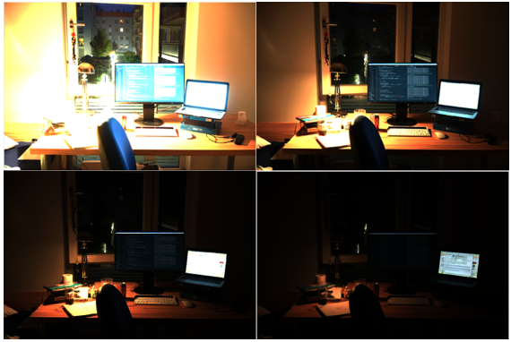
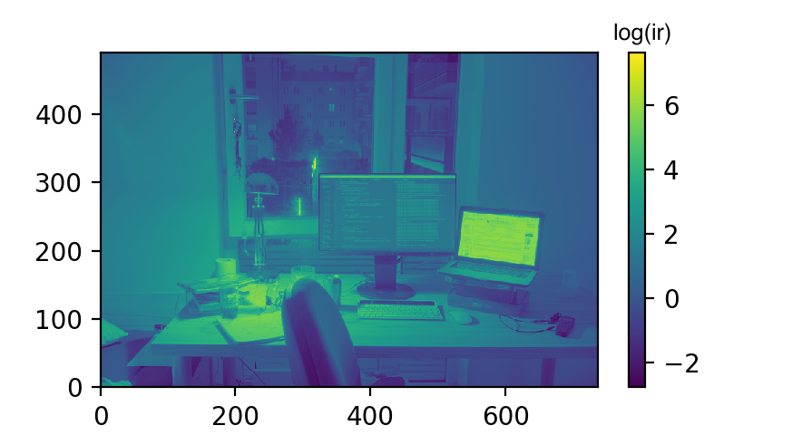

# HDR.jl

A small library written in Julia for combining images of multiple exposure settings into one HDR image.



### Installing

Install by cloning this repository into a local folder:

```
git clone git@github.com:cvcore/HDR.jl.git
```

Then to import this library into your project:

```
push!(LOAD_PATH, "/PATH_CONTAINING_HDR.jl")
using HDR
```

### Usage

First, download [our HDR image sequences](https://www.dropbox.com/s/vfmilx6e7fc6qp4/HDRsequence.zip?dl=0) / generating your own dataset.

Then read the images into Julia:

```
hdrseq = read_hdrgen_file("/PATH_TO_HDRGEN_FILE/hdrgen.hdrgen");
```

If the images are too large, you may want to downsample them first. We provide you with a Gaussian-based downsampler:

```
downsampled_seq = hdr_sequence_downsample(hdrseq, downsample_ratio = 10)
```

Estimating the true irradiance and reconstructing your camera's response curve:

```
ir, res = image_synthesis(dseq)
```


To visualize the irradiance range:

```
pseudo_color_visualizer(ir)
```

### Note

Please make sure for each pixel in your images at least one image covers its correct exposure. Otherwise, that pixel will be NaN in the resulting image. Currently we don't handle this. But you can try to interpolate that value yourself, for example:

```
ir_nonan = copy(ir)
ir_nonan[isnan(ir_nonan)] = maximum(ir)
```



## License

MIT
